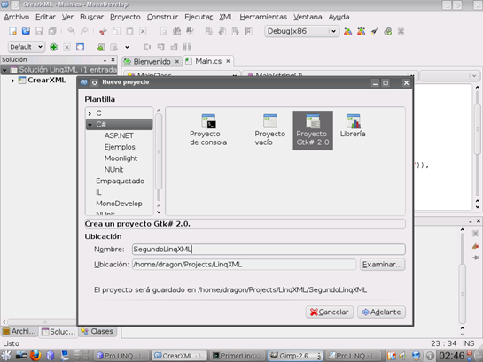
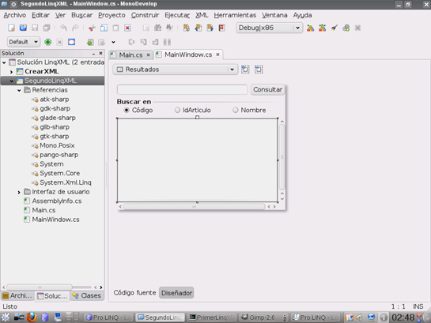
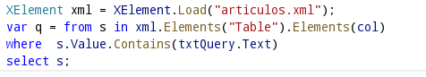
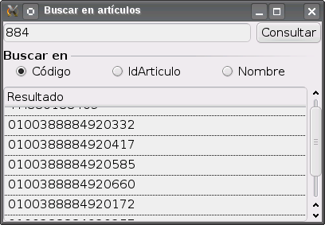
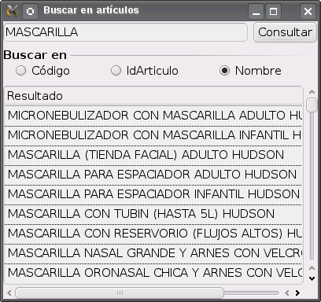

# Trabajando LINQ para XML con Monodevelop Parte II de II

Esta es la segunda parte del post anterior Trabajando LINQ para XML con Monodevelop, aunque este tutorial supone que los dos proyectos están dentro la misma solución, los dos proyectos son independientes uno del otro, por lo que pueden crearse en diferentes soluciones.

<h3>Consultando XML con LINQ</h3>

Ahora agregamos un segundo proyecto a nuestra solución, este proyecto será una aplicación GTK# que llamaremos “SegundoLinqXML” como se muestra en la siguiente imagen y que nos mostrará como consultar el archivo XML con LINQ creado con la aplicación de consola anterior.

Utilizando el diseñador agregamos y acomodamos los siguientes controles GTK# con sus respectivos identificadores al formulario.

<table>
<tr>
  <td>Tipo de control:</td>
  <td>Gtk.Entry</td>
  <td>Nombre</td>
  <td>txtQuery</td>
</tr>
<tr>
  <td>Tipo de control:</td>
  <td>Gtk.Button</td>
  <td>Nombre</td>
  <td>BtnBuscar</td>
</tr>
<tr>
  <td>Tipo de control:</td>
  <td>Gtk.RadioButton</td>
  <td>Nombres</td>
  <td>RbCodigo,rbIdArticulo,rbNombre</td>
</tr>
<tr>
  <td>Tipo de control:</td>
  <td>Gtk.TreeView</td>
  <td>Nombres</td>
  <td>Resultados</td>
</tr>
</table>

Colocando los controles el formulario deberá verse como en la siguiente imagen

El siguiente fragmento de código muestra como realizar la consulta del archivo XML donde la variable col adquiere el valor de cualquier elemento dentro del elemento table y donde el valor contenga el texto escrito dentro de txtQuery, es aquí donde en esencia se utilizan las expresiones de consulta de LINQ una vez que se carga el documento XML en memoria.

Construimos la aplicación pulsando el botón F8, seleccionamos el archivo de proyecto y haciendo click con e botón secundario del ratón seleccionamos la aplicación para que se inicie al ejecutar la solución, al ejecutarla teclear un valor y pulsar el botón consultar observaremos cualquiera de los siguientes resultados dependiendo del control radio seleccionado.

